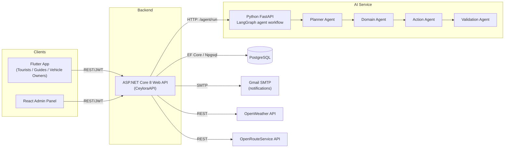

# CEYLORA

CEYLORA is a Sri Lankan tourism platform that connects tourists with guides, vehicle owners, hotels and curated travel packages, with an AI agent service that plans custom trips on request. Built for SE3090 (Assignment 1).

[](https://github.com/IT24102003/CEYLORA/actions/workflows/backend-tests.yml)
[](https://github.com/IT24102003/CEYLORA/actions/workflows/frontend-tests.yml)
[](https://github.com/IT24102003/CEYLORA/actions/workflows/mobile-tests.yml)
[](https://github.com/IT24102003/CEYLORA/actions/workflows/agentic-ai-tests.yml)

## Live deployment

- **Backend API**: [ceylora-production.up.railway.app](https://ceylora-production.up.railway.app) (Railway, free tier, Docker — see [`backend/Dockerfile`](backend/Dockerfile)). Interactive API docs: [/swagger](https://ceylora-production.up.railway.app/swagger).
- **Admin panel**: [mellifluous-fox-a71ffb.netlify.app](https://mellifluous-fox-a71ffb.netlify.app) (Netlify, built from `frontend-react`, pointed at the live backend above via `VITE_API_ROOT`).

The backend connects to PostgreSQL through Supabase's connection pooler (`aws-0-ap-south-1.pooler.supabase.com:6543`, transaction mode) rather than the direct host, since Railway has no outbound IPv6 route to Supabase's direct-connection address.

The mobile app defaults to a local backend for development; set `useDeployedBackend = true` in `mobile-flutter/lib/services/api_service.dart` to point a build at the live instance above instead.

## What it does

- **Tourists** browse destinations, hotels and packages, book a trip (from a package or a custom AI-planned itinerary), pay, chat with their assigned guide, and leave a review.
- **Guides** and **Vehicle Owners** manage their own availability, vehicles and assigned trips.
- **Admins** run the admin panel — approve/reject AI-generated trip plans, manage the catalogue (packages, hotels, destinations), and view analytics.
- An **AI agent workflow** (Planner → Domain Analysis → Action → Validation) turns a free-text trip objective ("5 days around the hill country for a family of 4") into a concrete itinerary with a matched guide and vehicle, which an Admin then approves.

## Architecture



The AI service is only ever called by the backend — neither client talks to it directly. Every agent run is persisted (`AgentWorkflow` + `AgentExecutionLog`) so Admins can review what the AI decided and why before approving a plan.

See [`docs/er-diagram.md`](docs/er-diagram.md) for the full database entity-relationship diagram, and [`docs/adr/`](docs/adr/) for the reasoning behind the major technical decisions.

## Tech stack

| Layer | Stack |
|---|---|
| Backend API | ASP.NET Core 8, EF Core + Npgsql (PostgreSQL), JWT auth, BCrypt, MailKit |
| Admin panel | React 19 + Vite, React Router, Axios |
| Mobile app | Flutter, Provider (state management), `http` |
| AI agent service | Python, FastAPI, LangGraph + LangChain (Ollama LLM) |
| Testing | xUnit + Moq + EF Core InMemory (backend) · Vitest + React Testing Library (frontend) · `flutter_test` (mobile) · pytest + pytest-asyncio (AI service) |
| CI/CD | GitHub Actions — 4 independent, path-filtered pipelines (see [ADR 0005](docs/adr/0005-ci-four-path-filtered-pipelines.md)) |

## Repository structure

```
CEYLORA/
├── backend/
│   ├── CeyloraAPI/            # ASP.NET Core Web API
│   └── CeyloraAPI.Tests/      # xUnit test suite
├── frontend-react/            # Admin panel (Vite + React)
│   └── src/**/*.test.jsx      # Vitest + RTL tests, colocated with source
├── mobile-flutter/            # Flutter app
│   └── test/                  # unit / provider / screen widget tests
├── agentic-ai/                # FastAPI + LangGraph agent service
│   └── tests/                 # pytest suite
├── docs/
│   ├── adr/                   # Architecture Decision Records
│   └── er-diagram.md          # Database ER diagram (Mermaid)
└── .github/workflows/         # 4 CI pipelines, one per stack
```

## Getting started

Each stack has its own setup/run instructions in its own README:

- [`backend/README.md`](backend/README.md) — ASP.NET Core API
- [`frontend-react/README.md`](frontend-react/README.md) — Admin panel
- [`mobile-flutter/README.md`](mobile-flutter/README.md) — Flutter app
- [`agentic-ai/README.md`](agentic-ai/README.md) — AI agent service

## Running the tests

| Stack | Command | Location |
|---|---|---|
| Backend | `dotnet test` | `backend/CeyloraAPI.Tests/` |
| Frontend | `npm test` | `frontend-react/` |
| Mobile | `flutter test` | `mobile-flutter/` |
| AI service | `pytest` | `agentic-ai/` |

All 4 run automatically on every push/PR to `main` via GitHub Actions (badges above).

## Documentation

- [Architecture Decision Records](docs/adr/) — why each major technical choice was made
- [ER diagram](docs/er-diagram.md) — database schema and relationships
