# CEYLORA — Entity Relationship Diagram

This diagram reflects the EF Core models in `backend/CeyloraAPI/Models` (PostgreSQL via Npgsql). It covers the core booking/marketplace tables; a few purely-lookup fields are omitted for readability (see the model classes themselves for the full field list).

```mermaid
erDiagram
    USER ||--o{ BOOKING : "makes (as Tourist)"
    USER ||--o| GUIDE : "profile (Role=Guide)"
    USER ||--o| VEHICLE_OWNER : "profile (Role=VehicleOwner)"
    USER ||--o{ FAVORITE : saves
    USER ||--o{ NOTIFICATION : receives
    USER ||--o{ REVIEW : writes
    USER ||--o{ CHAT_MESSAGE : sends

    VEHICLE_OWNER ||--o{ VEHICLE : owns
    GUIDE ||--o{ ASSIGNMENT : "assigned to"
    VEHICLE ||--o{ ASSIGNMENT : "assigned to"
    VEHICLE ||--o{ VEHICLE_IMAGE : has

    PACKAGE ||--o{ PACKAGE_DESTINATION : includes
    PACKAGE ||--o{ PACKAGE_HOTEL : includes
    PACKAGE |o--o| GUIDE : "suggested guide"
    PACKAGE |o--o| VEHICLE : "suggested vehicle"
    DESTINATION ||--o{ PACKAGE_DESTINATION : "featured in"
    HOTEL ||--o{ PACKAGE_HOTEL : "featured in"
    HOTEL ||--o{ HOTEL_IMAGE : has

    BOOKING |o--o| PACKAGE : "based on (optional — or a custom trip)"
    BOOKING ||--o| ASSIGNMENT : "guide + vehicle"
    BOOKING ||--o{ HOTEL_BOOKING : includes
    BOOKING ||--o| ITINERARY : "AI/manual plan"
    BOOKING ||--o{ PAYMENT : "paid via"
    BOOKING ||--o{ REVIEW : "reviewed via"
    BOOKING ||--o{ CHAT_MESSAGE : "chat thread"
    BOOKING |o--o| AGENT_WORKFLOW : "triggers"

    HOTEL_BOOKING }o--|| HOTEL : at

    ITINERARY ||--o{ ITINERARY_DAY : "day-by-day plan"

    AGENT_WORKFLOW ||--o{ AGENT_EXECUTION_LOG : "step-by-step trace"

    USER {
        int Id PK
        string Name
        string Email
        string PasswordHash
        enum Role "Tourist | Guide | Admin | VehicleOwner"
        string Country
        string MobileNumber
    }

    GUIDE {
        int Id PK
        int UserId FK
        string Languages
        string Region
        double Rating
        bool IsAvailable
        bool IsVerified
    }

    VEHICLE_OWNER {
        int Id PK
        int UserId FK
        string Region
        bool IsVerified
    }

    VEHICLE {
        int Id PK
        int OperatorId FK "-> VehicleOwner"
        string Type "Car | Van | Bus"
        int Capacity
        string Region
        decimal PricePerKm
        bool IsAvailable
        double Rating
    }

    DESTINATION {
        int Id PK
        string Name
        string Region
        string Category
        double Latitude
        double Longitude
    }

    HOTEL {
        int Id PK
        string Name
        string Region
        int StarRating
        double Rating
        decimal PricePerNight
        int RoomsAvailable
    }

    PACKAGE {
        int Id PK
        string Name
        decimal BasePrice
        int DurationDays
        int MaxPeople
        int SuggestedGuideId FK
        int SuggestedVehicleId FK
        bool IsPublished
    }

    PACKAGE_DESTINATION {
        int Id PK
        int PackageId FK
        int DestinationId FK
        int DayNumber
    }

    PACKAGE_HOTEL {
        int Id PK
        int PackageId FK
        int HotelId FK
    }

    BOOKING {
        int Id PK
        int TouristId FK "-> User"
        int PackageId FK "nullable — custom trip if null"
        enum Status "Pending | Confirmed | OnGoing | Ended | Cancelled | Rejected"
        bool IsPaid
        int GroupSize
        decimal TotalPrice
        DateTime PlannedStartDate
    }

    HOTEL_BOOKING {
        int Id PK
        int BookingId FK
        int HotelId FK
        DateTime CheckIn
        DateTime CheckOut
    }

    ASSIGNMENT {
        int Id PK
        int BookingId FK
        int GuideId FK
        int VehicleId FK
        DateTime AssignedAt
    }

    ITINERARY {
        int Id PK
        int BookingId FK
        string GeneratedBy "AI | Manual"
    }

    ITINERARY_DAY {
        int Id PK
        int ItineraryId FK
        int DayNumber
        string ActivitiesJson "jsonb"
    }

    PAYMENT {
        int Id PK
        int BookingId FK
        decimal Amount
        string Provider
    }

    REVIEW {
        int Id PK
        int BookingId FK
        int TouristId FK
        int Rating "1-5"
        int HotelRating
        int VehicleRating
    }

    FAVORITE {
        int Id PK
        int UserId FK
        string ItemType "Destination|Package|Hotel|Guide|Vehicle"
        int ItemId
    }

    NOTIFICATION {
        int Id PK
        int UserId FK
        string Type
        bool IsRead
    }

    CHAT_MESSAGE {
        int Id PK
        int BookingId FK
        int SenderId FK
        string SenderRole
        bool IsRead
    }

    AGENT_WORKFLOW {
        int Id PK
        int BookingId FK
        int TouristId FK
        string Objective
        string PlanJson
        enum Status "Running | Completed | Failed"
        enum ApprovalStatus
    }

    AGENT_EXECUTION_LOG {
        int Id PK
        int WorkflowId FK
        string AgentName "Planner|Domain|Action|Validation"
        string StepName
        string Input
        string Output
    }
```



## Notes

- `Favorite.ItemType` + `ItemId` is a polymorphic reference (no FK constraint at the DB level) so a tourist can favorite a Destination, Package, Hotel, Guide, or Vehicle from one table.
- A `Booking` is either built from a `Package` (`PackageId` set) **or** a custom AI-planned trip (`CustomTripObjective`/`CustomTripDurationDays`/`CustomTripName` set instead, `PackageId` null).
- `AgentWorkflow` → `AgentExecutionLog` is the audit trail produced by the Python agentic-ai service (Planner → Domain Analysis → Action → Validation), written back to Postgres by the ASP.NET Core backend via `AgentWorkflowController`.
- View this diagram rendered: paste the ```mermaid block into the [Mermaid Live Editor](https://mermaid.live), or view this file directly on GitHub (GitHub renders Mermaid natively in `.md` files).
